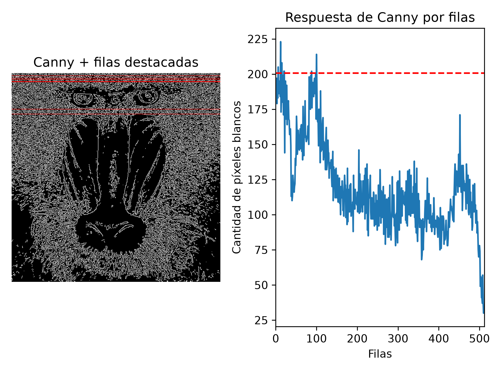
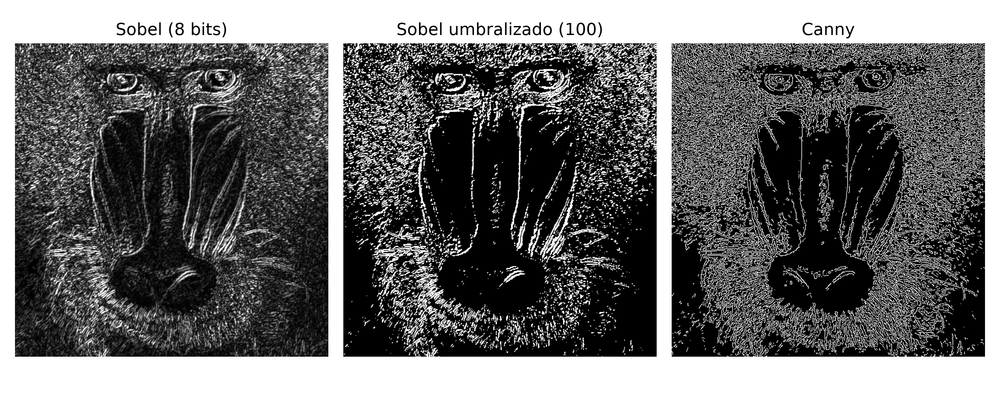
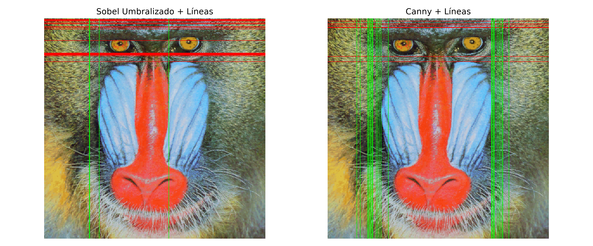
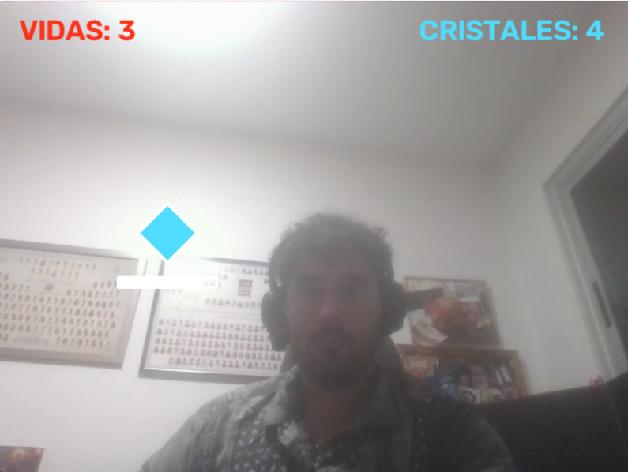

# Práctica 2 - Visión por Computador

## Autoría

**Grupo 33**

- Alvaro García Suarez
- Enlace github: [Alvaro](https://github.com/agsuarezz)
- Marcos González Gómez
- Enlace github: [Marcos](https://github.com/mgz00)

---

## Descripción

En esta práctica se han trabajado distintas técnicas básicas de procesamiento de imagen con OpenCV, centrándonos en la detección y análisis de bordes y en el uso de la webcam para crear una interacción en tiempo real.

El trabajo realizado se divide en tres partes:

1. Conteo de píxeles de borde por filas utilizando Canny.
2. Comparación entre los detectores de bordes Sobel y Canny mediante conteos por filas y columnas.
3. Desarrollo de un demostrador interactivo inspirado en las instalaciones vistas en clase, utilizando detección de movimiento mediante webcam.

---

## Trabajo realizado

### 1. Conteo de píxeles blancos por filas con Canny

Partiendo de la imagen `mandril.jpg`, se convierte la imagen a escala de grises y se aplica el detector de bordes de Canny.

A continuación, se realiza el conteo de píxeles blancos de la imagen resultante para cada fila mediante `cv2.reduce`. A partir de estos valores se obtiene la fila con mayor número de píxeles blancos y se seleccionan todas aquellas filas cuyo valor es igual o superior al 90 % del máximo.

Las filas seleccionadas se representan gráficamente sobre la imagen resultante de Canny.

En la ejecución incluida en el notebook se obtuvo:

- Máximo de píxeles blancos en una fila: **223**
- Número de filas por encima del 90 % del máximo: **7**
- Filas seleccionadas: **6, 12, 15, 20, 21, 88 y 100**

### Resultado



---

### 2. Comparación entre Sobel y Canny

Se aplica el operador Sobel sobre una versión suavizada de la imagen en escala de grises. El resultado se convierte a 8 bits y posteriormente se umbraliza para poder trabajar con una imagen binaria.

Sobre esta imagen se realiza el conteo de píxeles no nulos tanto por filas como por columnas. Se seleccionan aquellas posiciones que superan el 90 % del máximo correspondiente y se dibujan sobre la imagen original.

El mismo procedimiento se realiza utilizando Canny para poder comparar ambos métodos.

### Sobel umbralizado



### Comparación final



### Resultados observados

Sobel presenta una mayor sensibilidad a zonas con mucha textura. En la imagen del mandril, el pelo genera una elevada concentración de bordes y provoca que determinadas filas acumulen una gran cantidad de píxeles blancos.

Canny produce bordes más finos y definidos, lo que permite identificar mejor estructuras concretas de la imagen. En la comparación realizada, las líneas seleccionadas mediante Canny delimitan de forma más clara distintas zonas de la cara del mandril.

Por tanto, para este ejemplo, Canny ofrece un resultado más limpio para realizar posteriormente el análisis mediante conteos por filas y columnas.

---

## 3. Demostrador interactivo: Rompe Cristales

Como reinterpretación de las instalaciones interactivas mostradas en clase, se ha desarrollado un pequeño juego controlado mediante los movimientos del usuario frente a una webcam.

La aplicación muestra cristales en posiciones aleatorias de los laterales de la imagen. El usuario debe interactuar con ellos realizando movimientos en la zona correspondiente.

Se han añadido dos tipos de cristales:

- **Cristal azul:** debe golpearse antes de que finalice el tiempo disponible. Al romperlo se incrementa la puntuación.
- **Cristal rojo:** debe evitarse. Si el jugador lo golpea pierde una vida, mientras que si deja que desaparezca no recibe ninguna penalización.

El jugador comienza con **3 vidas**. También se pierde una vida cuando un cristal azul desaparece sin haber sido golpeado. La partida termina cuando las vidas llegan a cero.

La dificultad aumenta progresivamente: el tiempo disponible para romper los cristales azules disminuye a medida que aumenta la puntuación, con un límite mínimo para evitar que el juego llegue a ser imposible.

### Procesamiento de imagen utilizado

Para detectar la interacción del jugador se utiliza el siguiente procedimiento:

1. Captura de fotogramas mediante webcam.
2. Conversión de cada fotograma a escala de grises.
3. Aplicación de un filtro Gaussiano para reducir ruido.
4. Cálculo de la diferencia absoluta entre el fotograma actual y el anterior con `cv2.absdiff`.
5. Umbralización de la imagen de diferencias.
6. Operaciones morfológicas para eliminar ruido y reforzar las regiones con movimiento.
7. Recorte de la región correspondiente al cristal activo.
8. Conteo de píxeles no nulos dentro de dicha región.
9. Si el movimiento supera un umbral establecido, se considera que el cristal ha sido golpeado.

De esta forma, no es necesario realizar reconocimiento de manos o de personas: la interacción se basa directamente en la cantidad de movimiento detectada en la zona en la que aparece cada cristal.

### Funcionamiento

- Los cristales aparecen únicamente en los laterales de la imagen para favorecer el movimiento de los brazos.
- La posición de cada cristal se genera aleatoriamente.
- Aproximadamente el **75 %** de los cristales son azules y el **25 %** son rojos.
- Los cristales disponen de una barra que indica el tiempo restante.
- Los cristales azules rotos incrementan el marcador.
- Golpear un cristal rojo resta una vida.
- No golpear un cristal azul antes de que desaparezca resta una vida.
- Dejar desaparecer un cristal rojo no produce penalización.
- El tiempo disponible comienza en **2,5 segundos** y disminuye progresivamente hasta un mínimo de **0,7 segundos**.
- Al llegar a cero vidas se muestra la pantalla de `GAME OVER`.

### Resultado del demostrador

Añadir antes de la entrega una captura del juego en funcionamiento:

```markdown

```

También es recomendable incluir un pequeño vídeo o GIF demostrativo del funcionamiento:

```markdown
[Vídeo de demostración](videos/demo_juego.mp4)
```

> **Importante:** estos dos archivos deben añadirse al repositorio para que puedan visualizarse desde el README. El vídeo debería mostrar al menos un cristal azul golpeado, un cristal rojo evitado y la actualización del marcador o las vidas.

---


## Requisitos

La práctica utiliza Python y las siguientes librerías:

```text
opencv-python
numpy
matplotlib
```

Pueden instalarse mediante:

```bash
pip install opencv-python numpy matplotlib
```

Para el demostrador interactivo es necesario disponer de una webcam accesible desde OpenCV.

---

## Ejecución

Abrir el notebook:

```bash
jupyter notebook VC_P2_Entrega_Grupo33.ipynb
```

y ejecutar las celdas en orden.

Para la parte interactiva:

- OpenCV utilizará por defecto la cámara con índice `0`.
- Si el equipo dispone de varias cámaras puede modificarse la variable `CAMERA`.
- Durante el juego, la ventana de OpenCV debe permanecer activa.
- La tecla `ESC` permite cerrar la aplicación.
- La tecla `R` permite reiniciar la partida tras finalizarla.

---

## Conclusiones

La práctica ha permitido comprobar las diferencias entre Sobel y Canny para la detección de bordes y utilizar posteriormente la información obtenida mediante conteos por filas y columnas.

Además, el demostrador final aplica las mismas ideas de procesamiento básico de imagen a una interacción en tiempo real. La diferencia entre fotogramas permite detectar movimientos del usuario de forma sencilla y utilizar esos cambios como mecanismo de entrada para un pequeño juego sin necesidad de utilizar modelos de reconocimiento o aprendizaje automático.
